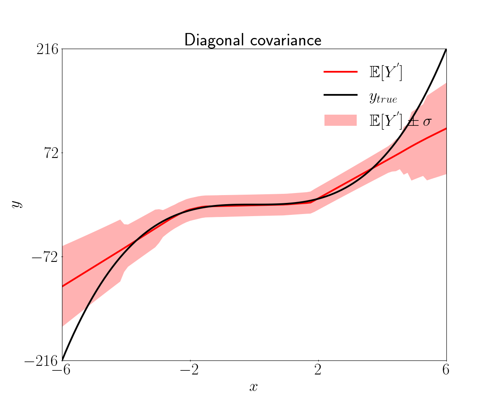

<!-------------------------------------------------------------------
File:         tutorial.md
Description:  FNN tutorial with 1D data
Authors:      Miquel Florensa & Luong-Ha Nguyen & James-A. Goulet
Created:      March 02, 2023
Updated:      March 02, 2023
Contact:      miquelflorensa11@gmail.com & luongha.nguyen@gmail.com & james.goulet@polymtl.ca
Copyright (c) 2023 Miquel Florensa & Luong-Ha Nguyen & James-A. Goulet. Some rights reserved.
-------------------------------------------------------------------->

# 1D toy regression problem

## Introduction

In this tutorial, we will see how to use pytagi to solve a simple regression problem. We will use a 1D toy dataset and a feedforward neural network (FNN) with a simple architecture.

## Define user input and data

In this simple example, we will use a 1D toy dataset. The dataset is composed of 10 training samples and 100 test samples.

```python
# User-input
num_inputs = 1
num_outputs = 1
num_epochs = 50
x_train_file = "./data/toy_example/x_train_1D.csv"
y_train_file = "./data/toy_example/y_train_1D.csv"
x_test_file = "./data/toy_example/x_test_1D.csv"
y_test_file = "./data/toy_example/y_test_1D.csv"
```

## Build Regression Model

We will use a FNN with a simple architecture. We will use the RegressionMLP class explained [here](#regression-mlp-class).

```python
# Model
net_prop = RegressionMLP()
```

## Data loader

We will use the RegressionDataLoader class explained [here](tutorial_data_loader.md) to load and process the data.

```python
# Data loader
reg_data_loader = RegressionDataLoader(num_inputs=num_inputs,
                                       num_outputs=num_outputs,
                                       batch_size=net_prop.batch_size)
data_loader = reg_data_loader.process_data(x_train_file=x_train_file,
                                           y_train_file=y_train_file,
                                           x_test_file=x_test_file,
                                           y_test_file=y_test_file)
```

## Train and test the model

Using the [regression class](https://github.com/lhnguyen102/cuTAGI/blob/main/python_examples/regression.py) that makes use of TAGI, we will train and test the model.

```python
    # Optional: Visualize the test using visualizer.py
    viz = PredictionViz(task_name="regression", data_name="toy1D")

    # Train and test
    reg_task = Regression(num_epochs=num_epochs,
                          data_loader=data_loader,
                          net_prop=net_prop,
                          viz=viz)
    reg_task.train()
    reg_task.predict(std_factor=3)
```

**PredictionViz class in [here](https://github.com/lhnguyen102/cuTAGI/blob/main/visualizer.py)*

## Results

The results are shown in the following figure. The black line is the true function, the red line is the predicted function and the red zone is the confidence intervals.



## Regression MLP class

The model will have 1 input layer, 1 hidden layer and 1 output layer. The input layer will have 1 neuron, the hidden layer will have 50 neurons and the output layer will have 1 neuron. The activation function of the hidden layer will be ReLU and the batch size will be 4. The observation noise's standard deviation and its minimum will be 0.06.

```python
# Model
from pytagi import NetProp

class RegressionMLP(NetProp):
    """Multi-layer perceptron for regression task"""

    def __init__(self) -> None:
        super().__init__()
        self.layers = [1, 1, 1]
        self.nodes = [1, 50, 1]
        self.activations = [0, 4, 0]
        self.batch_size = 4
        self.sigma_v = 0.06
        self.sigma_v_min: float = 0.06
        self.device = "cpu"
```
